<h1 align="center">Hi 👋, I'm odegejr</h1>
<h3 align="center">An Ethical Hacker</h3>

- 🔭 `[PROCESS: ACTIVE]` Currently working on **sharpening my offensive security skills**
- 🌱 `[PROCESS: LEARNING]` Currently deep-diving into **Ethical Hacking & Penetration Testing**

<h3 align="left">
  <code>The quieter you become, the more you are able to hear.</code> 
  🎭🕵️‍💻Anonymous 
</h3>

<!-- Hacker Terminal Banner -->

  

  

<h3 align="center">
  <code>Initializing CYGBA Protocol...</code>
</h3>

  

<h3 align="left">Connect with me:</h3>

<h3 align="left">Languages and Tools:</h3>

     

